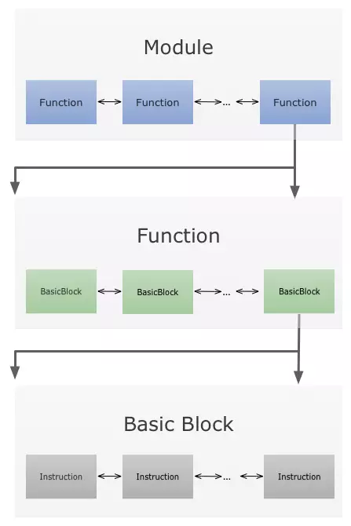
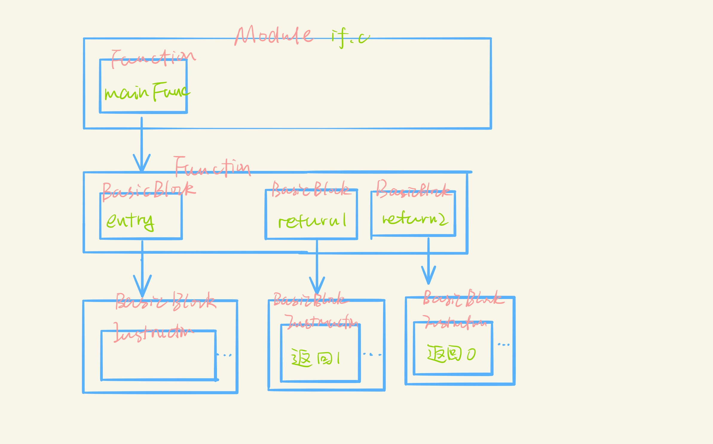
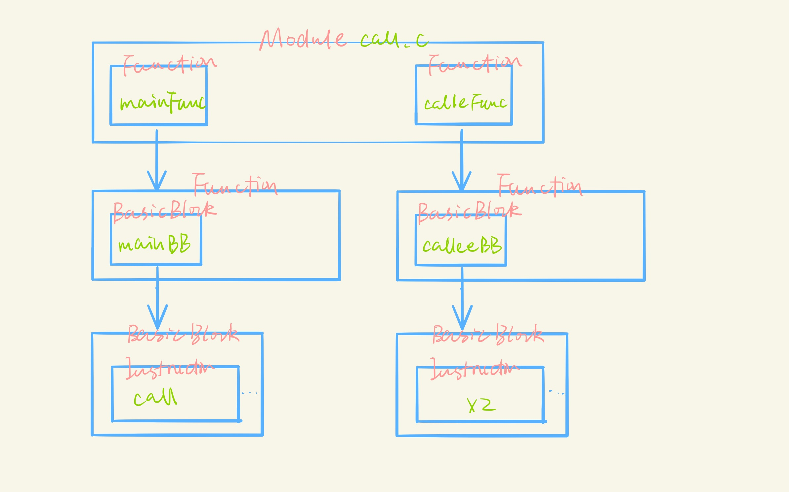
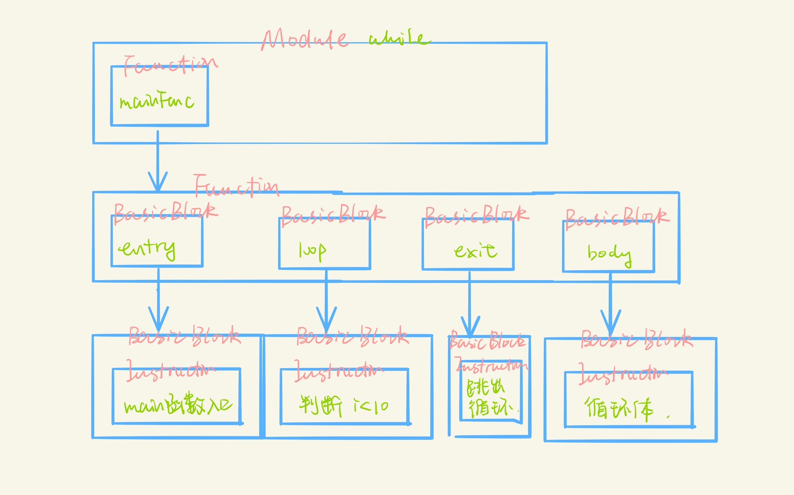
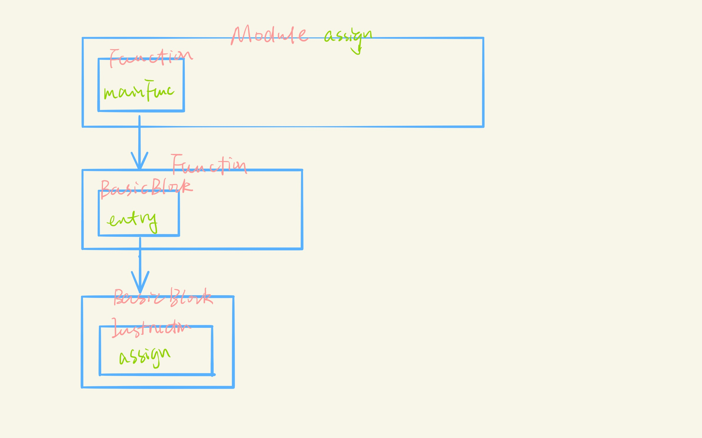
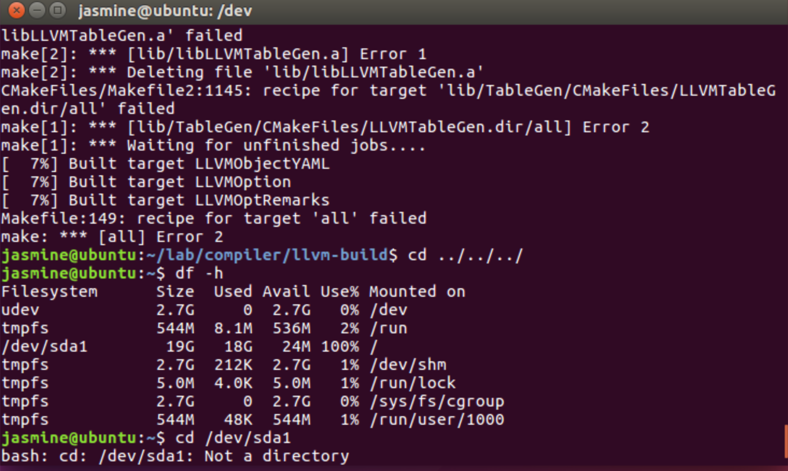

## lab3-0实验报告

姓名: 杨舒静 

学号: PB17151774

### 实验要求

1. 配置llvm IR 环境以及编译器环境
2. 学习LLVM IR语法
3. 学习用cpp调用LLVM IR库来生成LLVM IR中间表示

### 实验结果



llvm 核心类的结构关系如上。故可以得到如下结论
- 对于每一个程序应当创建一个为程序名的`Module`类
- 对于每一个函数应当创建一个`Function`类
- 对于每一个代码段在需要时需要创建`BasicBlock`类

以下根据本次实验中的小程序中类之间的依赖关系(由于关系较为简单没有采用标准的类图, 选择了与上图相同的格式，更为直观)

注:为了更好地显示`BasicBlock`之间的关系, 下图省略了`instructions`类的各个实例, 以伪代码表示大致操作。





以下为小代码段示例
#### 常见变量创建
```cpp

// 创建Module
auto module = new Module("assign.c", context);
// 创建Function
auto mainFun = Function::Create(FunctionType::get(TYPE32, false), GlobalValue::LinkageTypes::ExternalLinkage, "main", module);
// 创建BasicBlock
auto mainBB = BasicBlock::Create(context, "entry", mainFun);
```

#### 调用函数
```cpp
// 调用函数
auto call = builder.CreateCall(calleeFun, {retLoad});
// 获取参数 若为多个参数则为vector
auto arg = calleeFun->arg_begin();
// 函数返回
builder.CreateRet(res);
```

### 实验难点

#### 配置llvm环境

在编译安装llvm过程中, 由于硬件资源的不足(如上所示), 多次编译失败。尽管分配了4核, 4G内存仍然无法正常编译安装debug版本。在扩容后仍然艰难，于是最终选择了release版本, 经过大约1h30min的编译终于顺利编译安装。

在后续实验步骤中发现, LLVM 编译速度确实较慢。

#### 编码

实验过程中手动编写中间代码文件中出现了以上报错。发现不在函数头插入一个entry的label的话就会要求多一个“寄存器”保存地址。

查阅doc后发现


>Unnamed temporaries are numbered sequentially (using a per-function incrementing counter, starting with 0). Note that basic blocks and unnamed function parameters are included in this numbering. For example, if the entry basic block is not given a label name and all function parameters are named, then it will get number 0.

故如果在entry basic block中添加了label则临时寄存器变量从0开始计数。

#### 区分临时变量类型
临时变量类型可能为`i32`, `i32*`。区分每一个临时变量类型有利于减少融于代码。比如函数参数类型为`i32`时可以直接作为返回值或者返回值表达式中的参数

### 实验总结
本次实验入门了llvm-ir, 初步感受了中间代码的魅力所在。

#### Reference
[基本llvm语法](https://juejin.im/post/5ac2e17b5188254851534da2)

[doc1](https://mapping-high-level-constructs-to-llvm-ir.readthedocs.io/en/latest/basic-constructs/functions.html#simple-public-functions)

[llvm-doc](https://llvm.org/docs/LangRef.html)